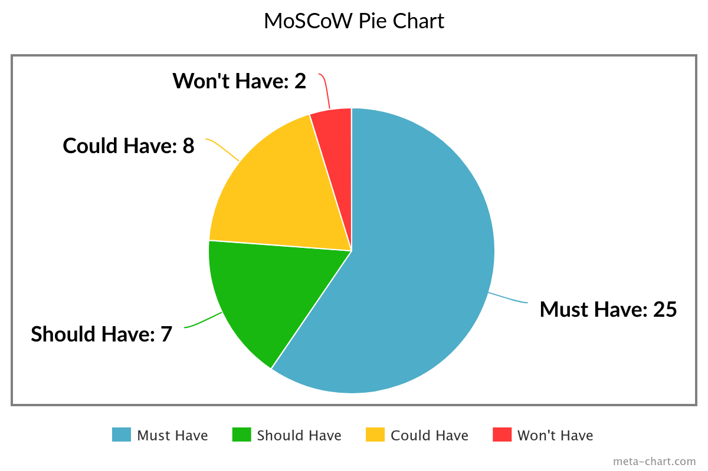

# Absolute Zero

 

Welcome to Absolute Zero, your ultimate destination for exquisite alcohol-free beverages! At Absolute Zero, we believe that enjoyment shouldn't compromise your lifestyle choices. Our carefully curated collection spans a wide range of flavors and styles, from sparkling sodas to artisanal mocktails, ensuring there's something to tantalize every taste bud. With a commitment to quality, innovation, and customer satisfaction, Absolute Zero is more than just a store – it's a lifestyle. Join us on a journey of flavor discovery and elevate your drinking experience with Absolute Zero. Because here, zero alcohol never means zero excitement. Cheers to a life of taste without compromise!🥂
    
Vissit Absolute Zero live website here! [Absolute Zero]()

Vissit Absolute Zero repository here! [Git Hub Absolute Zero](https://github.com/Tossan99/Absolute-Zero)

# Table of Contents

- [Absolute Zero](#absolute-zero)
- [Table of Contents](#table-of-contents)
- [Project Goals](#project-goals)
  * [User Goals:](#user-goals-)
  * [Owner/Admin Goals:](#owner-admin-goals-)
- [User Experience](#user-experience)
  * [Targeted Audience](#targeted-audience)
  * [First-Time Users](#first-time-users)
  * [Registered User](#registered-user)
  * [Admin user](#admin-user)
  * [User Stories](#user-stories)
    + [[Epic 1: Users First Impression]()](#-epic-1--users-first-impression---)
    + [[EPIC 2: Users Purchasing Products]()](#-epic-2--users-purchasing-products---)
    + [[EPIC 3: User Interaction and Engagement]()](#-epic-3--user-interaction-and-engagement---)
    + [[EPIC 4: Site Owner Moderate Content](https://github.com/Tossan99/osrs-tips/issues/4)](#-epic-4--site-owner-moderate-content--https---githubcom-tossan99-osrs-tips-issues-4-)
- [Design](#design)
  * [Logo](#logo)
  * [Fonts](#fonts)
  * [Background](#background)
  * [Color](#color)
  * [Wireframes](#wireframes)
- [Database](#database)
  * [E-commerce Database Schema](#e-commerce-database-schema)
    + [User Model](#user-model)
    + [Product Model](#product-model)
    + [Category Model](#category-model)
    + [Profile Model](#profile-model)
    + [Order Model](#order-model)
- [Technologies Used](#technologies-used)
    + [Languages](#languages)
    + [Frameworks](#frameworks)
    + [Database](#database-1)
    + [Tools](#tools)
    + [Supporting Libraries and Packages](#supporting-libraries-and-packages)
- [Agile Methodology](#agile-methodology)
    + [Agile Project Management with GitHub Projects](#agile-project-management-with-github-projects)
    + [User Stories as GitHub Issues](#user-stories-as-github-issues)
    + [Bug Tracking for Seamless Development](#bug-tracking-for-seamless-development)
    + [User Story Distribution (MoSCoW)](#user-story-distribution--moscow-)
- [Features](#features)
    + [Home/Landing Page](#home-landing-page)
    + [About Page](#about-page)
    + [Products Page](#products-page)
    + [Product Details Page](#product-details-page)
    + [Profile Page](#profile-page)
    + [Account Pages](#account-pages)
    + [Error pages](#error-pages)
    + [Future Features](#future-features)
- [Testing](#testing)
- [Bugs](#bugs)
    + [Known bugs](#known-bugs)
    + [Fixed bugs](#fixed-bugs)
- [Deployment and Local Development](#deployment-and-local-development)
  * [Local Development](#local-development)
    + [How to Fork](#how-to-fork)
    + [How to Clone](#how-to-clone)
    + [ElephantSQL Database](#elephantsql-database)
    + [Cloudinary](#cloudinary)
    + [Heroku Deployment](#heroku-deployment)
    + [Prepare environment and settings.py](#prepare-environment-and-settingspy)
    + [Add the following Config Vars in Heroku](#add-the-following-config-vars-in-heroku)
    + [Heroku needs two additional files to deploy properly](#heroku-needs-two-additional-files-to-deploy-properly)
    + [Deploy](#deploy)
- [Credits](#credits)
    + [Django Documentation](#django-documentation)
    + [Bootstrap Documentation](#bootstrap-documentation)
    + [Stripe Documentation](#stripe-documentation)
    + [Other guides](#other-guides)
    + [Content](#content)

<small><i><a href='http://ecotrust-canada.github.io/markdown-toc/'>Table of contents generated with markdown-toc</a></i></small>

<small><i><a href='http://ecotrust-canada.github.io/markdown-toc/'>Table of contents generated with markdown-toc</a></i></small>

# Project Goals

## User Goals

1. **Discover Exciting Options:** Enable users to explore a wide variety of alcohol-free beverage options, from classic favorites to innovative new releases.
2. **Convenient Shopping Experience:** Provide a seamless and user-friendly online shopping experience, allowing users to easily browse, select, and purchase their desired beverages.
3. **Quality Assurance:** Assure users of the quality and authenticity of the products offered, ensuring that every beverage meets high standards of taste and excellence.
4. **Personalization:** Offer personalized recommendations and suggestions based on user preferences and previous purchases, enhancing the shopping experience.
5. **Educational Resources:** Provide informative content and resources to educate users about alcohol-free beverages, their benefits, and different flavor profiles.
6. **Customer Support:** Offer responsive and helpful customer support to address any inquiries, concerns, or feedback from users promptly and effectively.

## Site Owner Goals

1. **Curated Selection:** Continuously curate and expand the selection of alcohol-free beverages to cater to diverse tastes and preferences, ensuring a comprehensive range of options for users.
2. **Supplier Partnerships:** Establish and maintain strong partnerships with reputable suppliers and brands to source high-quality ingredients and products consistently.
3. **Innovation and Differentiation:** Foster innovation in product development and flavor combinations to differentiate Absolute Zero from competitors and offer unique and enticing options.
4. **User Engagement:** Implement strategies to enhance user engagement and retention, such as personalized recommendations, loyalty programs, and social media initiatives.
5. **Quality Control:** Implement rigorous quality control measures to uphold the quality and integrity of products, ensuring customer satisfaction and trust.
6. **Continuous Improvement:** Regularly gather and analyze user feedback to identify areas for improvement and implement enhancements to the website, product offerings, and overall customer experience.
  
[Back to top ⇧](#table-of-contents)

# User Experience

## Targeted Audience

Absolute Zero is designed to cater to a diverse audience of individuals seeking high-quality, alcohol-free beverage options. Our primary target audience includes health-conscious consumers, designated drivers, non-drinkers, fitness enthusiasts, young adults exploring beverage options, and families seeking enjoyable, alcohol-free alternatives for gatherings and celebrations. By providing a welcoming and inclusive platform, Absolute Zero aims to offer delicious and satisfying beverages to suit the preferences and lifestyle choices of everyone.

## First-Time Users

Welcome to Absolute Zero! If you're new to our website, we're excited to introduce you to our selection of exquisite alcohol-free beverages. As a first-time user, you can expect a seamless shopping experience as you explore our wide variety of beverages, ranging from classic favorites to innovative new releases. Rest assured that every beverage meets our high standards of taste and excellence. Not sure where to start? Let us help you discover your new favorite with personalized recommendations based on your preferences and previous purchases. And if you have any questions or concerns, our friendly customer support team is here to assist you every step of the way. We're thrilled to have you join us on this journey of flavor discovery at Absolute Zero. Cheers to a life of taste without compromise!

## Registered User

## Site Owner

## User Stories

### [Epic 1: Users First Impression]()

- [USER STORY: Placeholder]()

### [EPIC 2: Users Purchasing Products]()

- [USER STORY: Placeholder]()

### [EPIC 3: User Interaction and Engagement]()

- [USER STORY: Placeholder]()

### [EPIC 4: Site Owner Moderating Content](https://github.com/Tossan99/osrs-tips/issues/4)

- [USER STORY: Placeholder]()

These user stories provide a framework for developing features and functionalities that cater to different aspects of the e-commerce platform, ensuring a seamless user experience from the initial impression to ongoing engagement and moderation.

For more information vissit the complete [Kanban Board here.](https://github.com/users/Tossan99/projects/7)

[Back to top ⇧](#table-of-contents)

# Design

## Logo

## Fonts

## Background

## Color

## Wireframes

Home page

About page

Log In page

[Back to top ⇧](#table-of-contents)

# Database

Mapping out the database structure before coding is crucial for organizing information, reducing errors, and improving efficiency. That is why a simple Database schema was made before the start of development.

## User Model

## Product Model

## Category Model

## Profile Model

## Order Model

[Back to top ⇧](#table-of-contents)

# Technologies Used

### Languages

- HTML
- CSS
- Python
- JS

### Frameworks

- **Django:** Django is a high-level Python web framework that encourages rapid development and clean, pragmatic design. Built by experienced developers, it takes care of much of the hassle of web development, so you can focus on writing your app without needing to reinvent the wheel. It’s free and open source.
- **Crispy Forms:** Django-crispy-forms is an application that helps to manage Django forms. It allows adjusting forms' properties (such as method, send button or CSS classes) on the backend without having to re-write them in the template.
- **Summernote:** Summernote is a lightweight, open-source WYSIWYG (What You See Is What You Get) text editor for web development. It allows users to easily create and customize rich-text content on websites, providing a user-friendly interface for text editing and formatting.
- **Bootstrap v5.0:** Bootstrap is a free, open source front-end development framework for the creation of websites and web apps. Designed to enable responsive development of mobile-first websites, Bootstrap provides a collection of syntax for template designs.
- **Cloudinary:** A cloud-based media management platform used for storing and serving images in the Blog Collective project.

### Database

- **ElephantSQL:** ElephantSQL is a service that offers PostgreSQL database hosting. It removes the tedious work by automating the setup and running of Postgres clusters. It also automates the tasks such as upgrades and backups

### Tools

- **GitHub:** GitHub is a web-based platform for version control using Git. It facilitates collaborative software development, allowing multiple contributors to work on projects, track changes, and manage code repositories.
- **Heroku:** Heroku is a cloud platform that enables developers to deploy, manage, and scale applications easily. It supports various programming languages and eliminates the need for infrastructure management, making it simpler to focus on building and deploying applications.
- **Google Fonts:** Google Fonts is a free and extensive collection of web fonts provided by Google. It allows website developers to embed customizable fonts, enhancing the typography of web content.
- **Font Awesome:** Font Awesome is a popular icon toolkit that provides a wide range of scalable vector icons. It's commonly used in web development to enhance the visual appeal and functionality of websites by easily incorporating icons into the design.

### Supporting Libraries and Packages

[Back to top ⇧](#table-of-contents)

# Agile Methodology

This project was developed using the Agile methodology. 
All epics and user stories implementation progress was registered using [GitHub](https://github.com/). As the user stories were accomplished, they were moved in the GitHub Kanban board from **ToDo**, to **In Progress**, **Done** and **Incomplete** lists.

Kanban Board Details

- **KANBAN BOARD**  
      
- **[Epic 1: Users First Impression]()** 
  - [USER STORY: Placeholder]()
-   
- **[Epic 2: Users Purchasing Products]()** 
  - [USER STORY: Placeholder]()
-   
- **[Epic 3: User Interaction and Engagement]()** 
  - [USER STORY: Placeholder]()
-   
- **[Epic 4: Site Owner Moderating Content]()** 
  - [USER STORY: Placeholder]()
-   

### Agile Project Management with GitHub Projects

To make managing projects easier, we use GitHub Projects as a central hub. User stories and tasks are like organized to-do lists, and the GitHub project board shows progress visually.

### User Stories as GitHub Issues

Turning user stories into GitHub issues helps organize user-focused features. These issues are linked to their corresponding user stories, making it easier to access criteria, tasks, and discussions.

### Bug Tracking for Seamless Development

We document bugs found during development as GitHub issues. This provides details on each bug's characteristics, impact, and how to reproduce it. By adding links to these issues in README.md, users can stay informed about bug fixes and share their thoughts.

### User Story Distribution (MoSCoW)

For this project, MoSCoW was used for the user stories to prioritizes implementation of features. MoSCoW is a project management framework that prioritizes requirements into four categories: `Must Have` (critical for success), `Should Have` (important), `Could Have` (desirable if resources permit), and `Won't Have` (explicitly excluded or deferred).

As seen in the chart below, the user stories prioritized as `Must Have` account for approximately 60%, while those prioritized as `Could Have` account for approximately 20%. The remaining 20% is shared between `Should Have` and `Won't Have`.

<small>The percentages aren't displayed in the pie chart since it's considered poor data representation to use percentage points for any data with fewer than 100 data points.</small>

[Back to top ⇧](#table-of-contents)

# Features

### Home/Landing Page

-  

See **Landing/About Page**

### About Page

-  

See **Landing/About Page**

### Products Page

-  

See **Landing/About Page**

### Product Details Page

-  

See **Landing/About Page**

### Profile Page

-  

See **Landing/About Page**

### Account Pages

-  

See **Landing/About Page**

### Error pages

-  

See **Landing/About Page**

### Future Features

These are some features that weren't added due to lack of time.

- **Placeholder:**

[Back to top ⇧](#table-of-contents)

# Testing

All testing was conducted and documented in [Testing.md](TESTING.md) for easy accessibility.

[Back to top ⇧](#table-of-contents)

# Bugs

### Known bugs

- [BUG: Plageholder]()

### Fixed bugs

- [BUG: Plageholder]()

For more information vissit the complete [Kanban Board here.]()

[Back to top ⇧](#table-of-contents)

# Deployment and Local Development

Live deployment can be found here [Absolute Zero]()

## Local Development

### How to Fork

1. Log in (or Sign Up) to Github
2. Go to repository for this project [Absolute Zero]()
3. Click the fork button in the top right corner

### How to Clone

1. Log in (or Sign Up) to Github
2. Go to repository for this project [Absolute Zero]()
3. Click on the code button, select whether you would like to clone with HTTPS, SSH or GitHub CLI and copy the link shown.
4. Open the terminal in your code editor and change the current working directory to the location you want to use for the cloned directory.
5. Type the following command in the terminal (after the git clone you will need to paste the link you copied in step 3 above)
6. Set up a virtual environment.
7. Install the packages from the requirements.txt file - run Command pip3 install -r requirements.txt

### ElephantSQL Database

[Absolute Zero]() is using [ElephantSQL](https://www.elephantsql.com/) PostgreSQL Database

1. Click Create New Instance to start a new database.
2. Provide a name.
3. Select the Tiny Turtle (Free) plan.
4. You can leave the Tags blank.
5. Select the Region and Data Center closest to you.
6. Once created, click on the new database name, where you can view the database URL and Password.

### Cloudinary

[Absolute Zero]() is using [Cloudinary](https://cloudinary.com/)

1. For Primary interest, you can choose Programmable Media for image and video API.
2. Optional: edit your assigned cloud name to something more memorable.
3. On your Cloudinary Dashboard, you can copy your API Environment Variable.
4. Be sure to remove the CLOUDINARY_URL= as part of the API value; this is the key.

### Heroku Deployment

* Log into [Heroku](https://www.heroku.com/) account or create an account.
* Click the "New" button at the top right corner and select "Create New App".
* Enter a unique application name
* Select your region
* Click "Create App"

### Prepare environment and settings.py

* In your workspace, create an env.py file in the main directory.
* Add the DATABASE_URL value and your chosen SECRET_KEY value to the env.py file.
* Update the settings.py file to import the env.py file and add the SECRETKEY and DATABASE_URL file paths.
* Comment out the default database configuration.
* Save all files and make migrations.
* Add the Cloudinary URL to env.py
* Add the Cloudinary libraries to the list of installed apps.
* Add the STATIC files settings - the url, storage path, directory path, root path, media url and default file storage path.
* Link the file to the templates directory in Heroku.
* Change the templates directory to TEMPLATES_DIR
* Add Heroku to the ALLOWED_HOSTS list the format ['app_name.heroku.com', 'localhost']

### Add the following Config Vars in Heroku

* SECRET_KEY - This can be any Django random secret key
* CLOUDINARY_URL - Insert your own Cloudinary API key
* DISABLE_COLLECTSTATIC = 1 - this is temporary, and can be removed for the final deployment
* DATABASE_URL - Insert your own ElephantSQL database URL here

### Heroku needs two additional files to deploy properly

* requirements.txt
* Procfile

### Deploy

1. Make sure DEBUG = False in the settings.py
2. Go to the deploy tab on Heroku and connect to GitHub, then to the required repository.
3. Scroll to the bottom of the deploy page and either click Enable Automatic Deploys for automatic deploys or Deploy Branch to deploy manually. Manually deployed branches will need re-deploying each time the GitHub repository is updated.
4. Click 'Open App' to view the deployed live site.

The site is now live

[Back to top ⇧](#table-of-contents)

# Credits

### Django Documentation

- [Placeholder]()

### Bootstrap Documentation

- [Placeholder]()

### Stripe Documentation

- [Placeholder]()

### Other guides

- [Placeholder]()

### Content 

- [Placeholder]()

[Back to top ⇧](#table-of-contents)