# Absolute Zero

<center> 


Welcome to Absolute Zero, your ultimate destination for exquisite alcohol-free beverages! At Absolute Zero, we believe that enjoyment shouldn't compromise your lifestyle choices. Our carefully curated collection spans a wide range of flavors and styles, from sparkling sodas to artisanal mocktails, ensuring there's something to tantalize every taste bud. With a commitment to quality, innovation, and customer satisfaction, Absolute Zero is more than just a store – it's a lifestyle. Join us on a journey of flavor discovery and elevate your drinking experience with Absolute Zero. Because here, zero alcohol never means zero excitement. Cheers to a life of taste without compromise!🥂
    
Visit Absolute Zero live website here! [Absolute Zero](https://absolut-zero-9622981fe97d.herokuapp.com/)

Visit Absolute Zero repository here! [Git Hub Absolute Zero](https://github.com/Tossan99/Absolute-Zero)


</center>

## Table of Contents

- [Absolute Zero](#absolute-zero)
- [Table of Contents](#table-of-contents)
- [Project Goals](#project-goals)
  * [User Goals:](#user-goals-)
  * [Owner/Admin Goals:](#owner-admin-goals-)
- [User Experience](#user-experience)
  * [Targeted Audience](#targeted-audience)
  * [First-Time Users](#first-time-users)
  * [Registered User](#registered-user)
  * [Admin user](#admin-user)
  * [User Stories](#user-stories)
    + [[Epic 1: Users First Impression]()](#-epic-1--users-first-impression---)
    + [[EPIC 2: Users Purchasing Products]()](#-epic-2--users-purchasing-products---)
    + [[EPIC 3: User Interaction and Engagement]()](#-epic-3--user-interaction-and-engagement---)
    + [[EPIC 4: Site Owner Moderate Content](https://github.com/Tossan99/osrs-tips/issues/4)](#-epic-4--site-owner-moderate-content--https---githubcom-tossan99-osrs-tips-issues-4-)
- [Design](#design)
  * [Logo](#logo)
  * [Fonts](#fonts)
  * [Background](#background)
  * [Color](#color)
  * [Wireframes](#wireframes)
- [Database](#database)
  * [E-commerce Database Schema](#e-commerce-database-schema)
    + [User Model](#user-model)
    + [Product Model](#product-model)
    + [Category Model](#category-model)
    + [Profile Model](#profile-model)
    + [Order Model](#order-model)
- [Technologies Used](#technologies-used)
    + [Languages](#languages)
    + [Frameworks](#frameworks)
    + [Database](#database-1)
    + [Tools](#tools)
    + [Supporting Libraries and Packages](#supporting-libraries-and-packages)
- [Agile Methodology](#agile-methodology)
    + [Agile Project Management with GitHub Projects](#agile-project-management-with-github-projects)
    + [User Stories as GitHub Issues](#user-stories-as-github-issues)
    + [Bug Tracking for Seamless Development](#bug-tracking-for-seamless-development)
    + [User Story Distribution (MoSCoW)](#user-story-distribution--moscow-)
- [Features](#features)
    + [Home/Landing Page](#home-landing-page)
    + [About Page](#about-page)
    + [Products Page](#products-page)
    + [Product Details Page](#product-details-page)
    + [Profile Page](#profile-page)
    + [Account Pages](#account-pages)
    + [Error pages](#error-pages)
    + [Future Features](#future-features)
- [Testing](#testing)
- [Bugs](#bugs)
    + [Known bugs](#known-bugs)
    + [Fixed bugs](#fixed-bugs)
- [Deployment and Local Development](#deployment-and-local-development)
  * [Local Development](#local-development)
    + [How to Fork](#how-to-fork)
    + [How to Clone](#how-to-clone)
    + [ElephantSQL Database](#elephantsql-database)
    + [Cloudinary](#cloudinary)
    + [Heroku Deployment](#heroku-deployment)
    + [Prepare environment and settings.py](#prepare-environment-and-settingspy)
    + [Add the following Config Vars in Heroku](#add-the-following-config-vars-in-heroku)
    + [Heroku needs two additional files to deploy properly](#heroku-needs-two-additional-files-to-deploy-properly)
    + [Deploy](#deploy)
- [Credits](#credits)
    + [Django Documentation](#django-documentation)
    + [Bootstrap Documentation](#bootstrap-documentation)
    + [Stripe Documentation](#stripe-documentation)
    + [Other guides](#other-guides)
    + [Content](#content)

<small><i><a href='http://ecotrust-canada.github.io/markdown-toc/'>Table of contents generated with markdown-toc</a></i></small>

## Project Goals

### User Goals

1. **Discover Exciting Options:** Enable users to explore a wide variety of alcohol-free beverage options, from classic favorites to innovative new releases.
2. **Convenient Shopping Experience:** Provide a seamless and user-friendly online shopping experience, allowing users to easily browse, select, and purchase their desired beverages.
3. **Quality Assurance:** Assure users of the quality and authenticity of the products offered, ensuring that every beverage meets high standards of taste and excellence.
4. **Personalization:** Offer personalized recommendations and suggestions based on user preferences and previous purchases, enhancing the shopping experience.
5. **Educational Resources:** Provide informative content and resources to educate users about alcohol-free beverages, their benefits, and different flavor profiles.
6. **Customer Support:** Offer responsive and helpful customer support to address any inquiries, concerns, or feedback from users promptly and effectively.

### Site Owner Goals

1. **Curated Selection:** Continuously curate and expand the selection of alcohol-free beverages to cater to diverse tastes and preferences, ensuring a comprehensive range of options for users.
2. **Supplier Partnerships:** Establish and maintain strong partnerships with reputable suppliers and brands to source high-quality ingredients and products consistently.
3. **Innovation and Differentiation:** Foster innovation in product development and flavor combinations to differentiate Absolute Zero from competitors and offer unique and enticing options.
4. **User Engagement:** Implement strategies to enhance user engagement and retention, such as personalized recommendations, loyalty programs, and social media initiatives.
5. **Quality Control:** Implement rigorous quality control measures to uphold the quality and integrity of products, ensuring customer satisfaction and trust.
6. **Continuous Improvement:** Regularly gather and analyze user feedback to identify areas for improvement and implement enhancements to the website, product offerings, and overall customer experience.
  
[Back to top ⇧](#table-of-contents)

## User Experience

### Targeted Audience

Absolute Zero is designed to cater to a diverse audience of individuals seeking high-quality, alcohol-free beverage options. Our primary target audience includes health-conscious consumers, designated drivers, non-drinkers, fitness enthusiasts, young adults exploring beverage options, and families seeking enjoyable, alcohol-free alternatives for gatherings and celebrations. By providing a welcoming and inclusive platform, Absolute Zero aims to offer delicious and satisfying beverages to suit the preferences and lifestyle choices of everyone.

### First-Time Users

As a first-time user, you'll find our website intuitive and user-friendly. Easily navigate through our curated selection of alcohol-free beverages with clear menus and prominent buttons. Discover detailed product descriptions to make informed choices, and enjoy a hassle-free checkout process.

### Registered User

For our registered users, Absolut Zero offers added convenience and personalized features. Access your account dashboard to view order history and manage shipping details seamlessly.

### Site Owner

As a site owner, Absolut Zero provides you with comprehensive tools to manage and grow your e-commerce business efficiently. Easily update product listings and manage content through the admin panel.

### User Stories

#### [Epic 1: Users First Impression](https://github.com/Tossan99/absolut-zero/issues/1)

- [USER STORY: Landing page](https://github.com/Tossan99/absolut-zero/issues/5)
- [USER STORY: Navigation](https://github.com/Tossan99/absolut-zero/issues/6)
- [USER STORY: Responsiveness](https://github.com/Tossan99/absolut-zero/issues/7)
- [USER STORY: Search Bar](https://github.com/Tossan99/absolut-zero/issues/8)
- [USER STORY: Sort By Function](https://github.com/Tossan99/absolut-zero/issues/9)
- [USER STORY: Categories](https://github.com/Tossan99/absolut-zero/issues/10)
- [USER STORY: About Us Page](https://github.com/Tossan99/absolut-zero/issues/12)
- [USER STORY: Privacy Page](https://github.com/Tossan99/absolut-zero/issues/13)
- [USER STORY: Error Handler Page](https://github.com/Tossan99/absolut-zero/issues/14)
- [USER STORY: Product Details Page](https://github.com/Tossan99/absolut-zero/issues/15)
- [USER STORY: Browsing Products](https://github.com/Tossan99/absolut-zero/issues/16)
- [USER STORY: SEO](https://github.com/Tossan99/absolut-zero/issues/17)
- [USER STORY: Favicon ](https://github.com/Tossan99/absolut-zero/issues/46)

#### [EPIC 2: Users Purchasing Products](https://github.com/Tossan99/absolut-zero/issues/2)

- [USER STORY: FAQ Page](https://github.com/Tossan99/absolut-zero/issues/11)
- [USER STORY: Add Products](https://github.com/Tossan99/absolut-zero/issues/18)
- [USER STORY: Shopping Cart](https://github.com/Tossan99/absolut-zero/issues/19)
- [USER STORY: Safe Payment](https://github.com/Tossan99/absolut-zero/issues/20)
- [USER STORY: Confirmation Page](https://github.com/Tossan99/absolut-zero/issues/21)
- [USER STORY: Email Confirmation](https://github.com/Tossan99/absolut-zero/issues/22)
- [USER STORY: Sales](https://github.com/Tossan99/absolut-zero/issues/24)
- [USER STORY: Loading Indicator](https://github.com/Tossan99/absolut-zero/issues/25)
- [USER STORY: Related Products](https://github.com/Tossan99/absolut-zero/issues/26)
- [USER STORY: Free Shipping](https://github.com/Tossan99/absolut-zero/issues/27)

#### [EPIC 3: User Interaction and Engagement](https://github.com/Tossan99/absolut-zero/issues/3)

- [USER STORY: Redirecting](https://github.com/Tossan99/absolut-zero/issues/23)
- [USER STORY: Profile Page](https://github.com/Tossan99/absolut-zero/issues/28)
- [USER STORY: Contact Details](https://github.com/Tossan99/absolut-zero/issues/29)
- [USER STORY: Profile Image](https://github.com/Tossan99/absolut-zero/issues/30)
- [USER STORY: Delete Profile](https://github.com/Tossan99/absolut-zero/issues/31)
- [USER STORY: View Public Profile](https://github.com/Tossan99/absolut-zero/issues/32)
- [USER STORY: Success and Error Messages](https://github.com/Tossan99/absolut-zero/issues/33)
- [USER STORY: Retrieve Password](https://github.com/Tossan99/absolut-zero/issues/34)
- [USER STORY: Rating Products](https://github.com/Tossan99/absolut-zero/issues/35)
- [USER STORY: Review Products](https://github.com/Tossan99/absolut-zero/issues/36)
- [USER STORY: Newsletter](https://github.com/Tossan99/absolut-zero/issues/37)
- [USER STORY: Live Help Chat](https://github.com/Tossan99/absolut-zero/issues/38)

#### [EPIC 4: Site Owner Moderating Content](https://github.com/Tossan99/absolut-zero/issues/4)

- [USER STORY: Testing](https://github.com/Tossan99/absolut-zero/issues/39)
- [USER STORY: Documentation](https://github.com/Tossan99/absolut-zero/issues/40)
- [USER STORY: Product CRUD Capabilities](https://github.com/Tossan99/absolut-zero/issues/41)
- [USER STORY: Reviews CRUD Capabilities](https://github.com/Tossan99/absolut-zero/issues/42)
- [USER STORY: Sales CRUD Capabilities](https://github.com/Tossan99/absolut-zero/issues/43)
- [USER STORY: User Profiles CRUD Capabilities](https://github.com/Tossan99/absolut-zero/issues/44)
- [USER STORY: Categories CRUD Capabilities](https://github.com/Tossan99/absolut-zero/issues/45)

These user stories provide a framework for developing features and functionalities that cater to different aspects of the e-commerce platform, ensuring a seamless user experience from the initial impression to ongoing engagement and moderation.

For more information visit the complete [Kanban Board here.](https://github.com/users/Tossan99/projects/7)

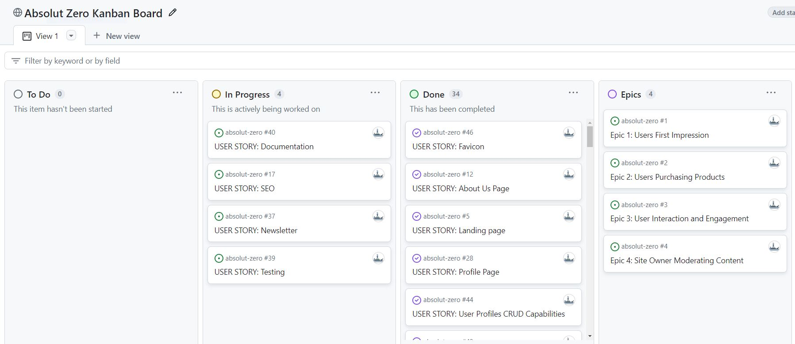

[Back to top ⇧](#table-of-contents)

## Design

### Logo
Our logo, ABSOLUT ZERO, embodies the essence of our brand with its bold and distinctive design. The word "ABSOLUT" is rendered in a big, bold black font reminiscent of the iconic Absolut Vodka logo. Meanwhile, "ZERO" is presented in the same font but with a color resembling frost, symbolizing purity and reminds customer the refreshing feeling of a cold drink. This combination creates a striking visual impact that instantly captures attention.


### Fonts
For the design of our website, we've chosen Roboto for all normal texts and Roboto Slab for headings. This combination provides a modern and clean aesthetic, ensuring readability and visual appeal across all devices and screen sizes. Roboto's versatility and sleek design perfectly complement our minimalist approach, while Roboto Slab adds a touch of sophistication to our headings, enhancing the overall user experience.

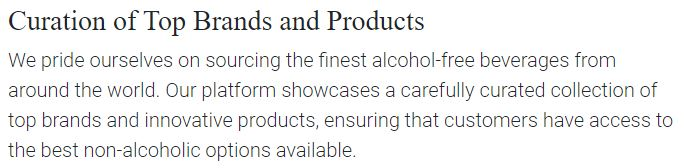

### Color
Our color palette is intentionally limited to black, white, blue, and light gray. This minimalist approach creates a clean and cohesive visual identity, allowing the content and products to take center stage. The use of black and white provides a timeless and elegant backdrop, while blue is strategically employed for small details such as buttons and borders, adding subtle pops of color without overwhelming the design. The light gray serves as a soft background color, enhancing readability and creating a sense of space and tranquility throughout the website.

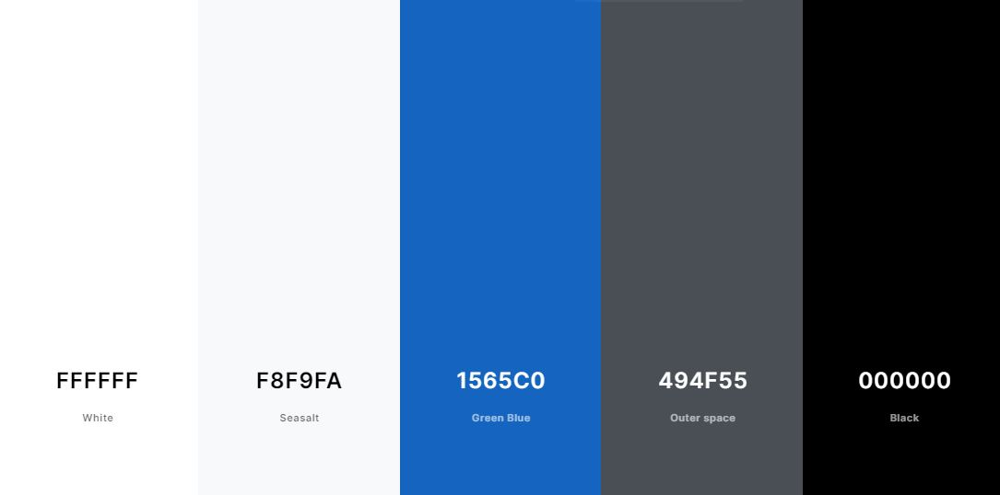

### Wireframes

These wireframes is a simple layout sketch used in the early design stages to plan the structure and key elements of the E-commerce. It provides a visual guide without delving into specific details, aiding in the initial planning of the design.
All wireframes was created with the help of [Balsamiq](https://balsamiq.com/).

<details><summary>Home page</summary>
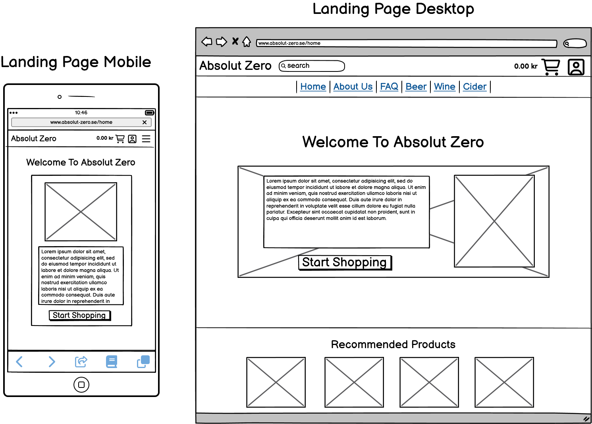
</details>
<details><summary>About age</summary>
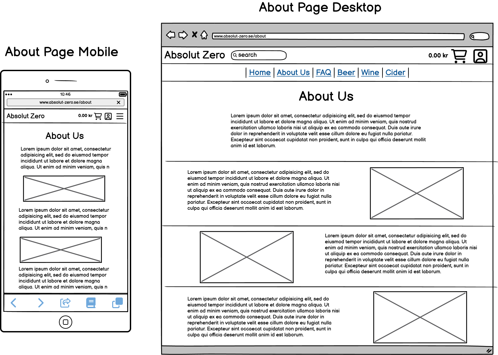
</details>
<details><summary>FAQ page</summary>
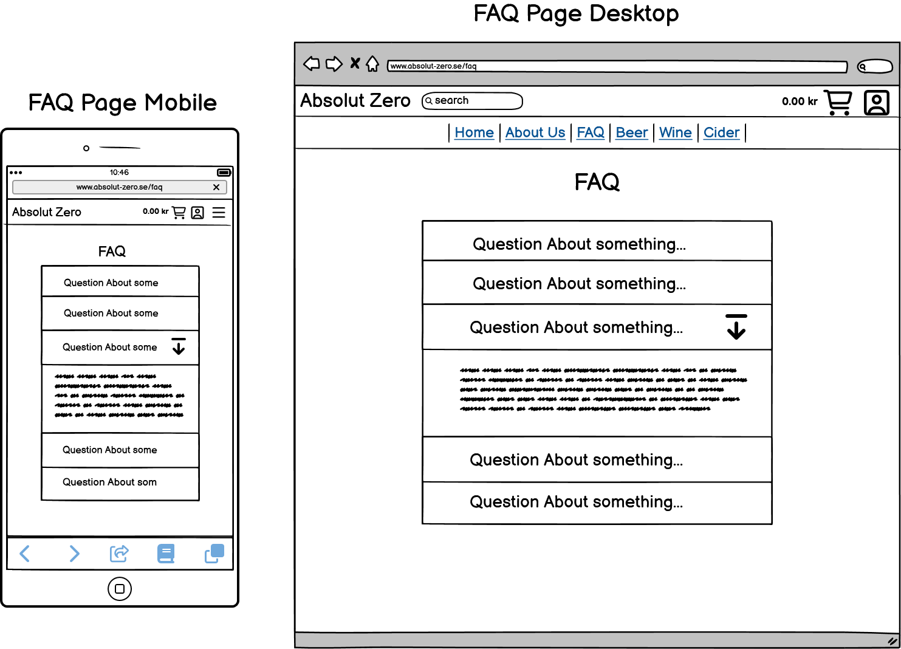
</details>
<details><summary>Products page</summary>
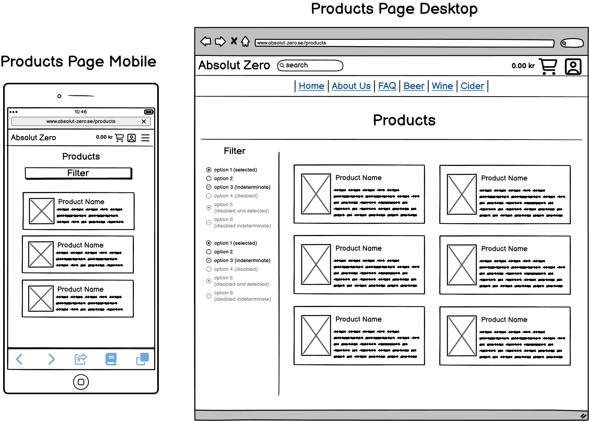
</details>
<details><summary>Products details page</summary>
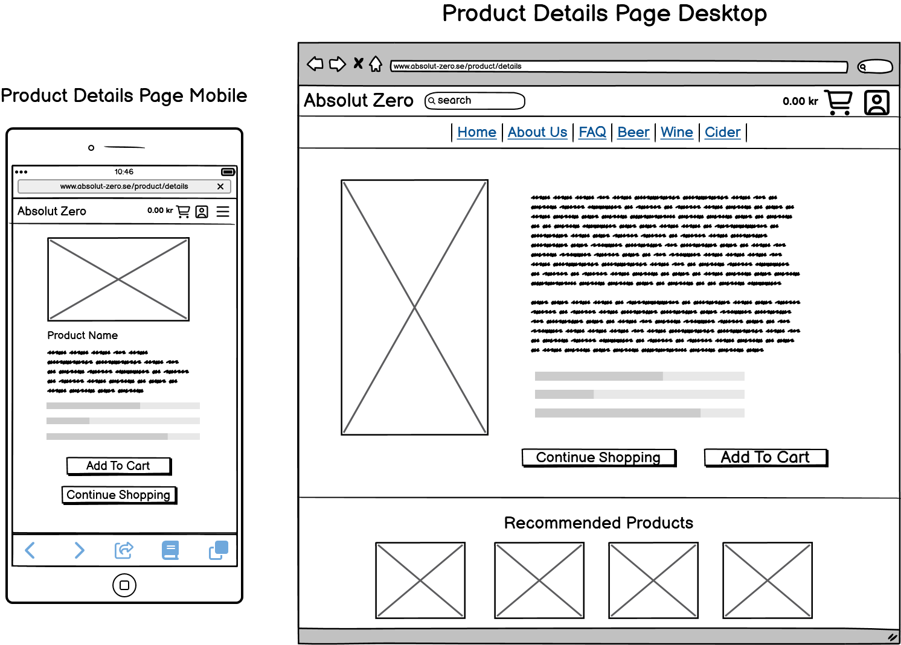
</details>
<details><summary>Shopping cart page</summary>
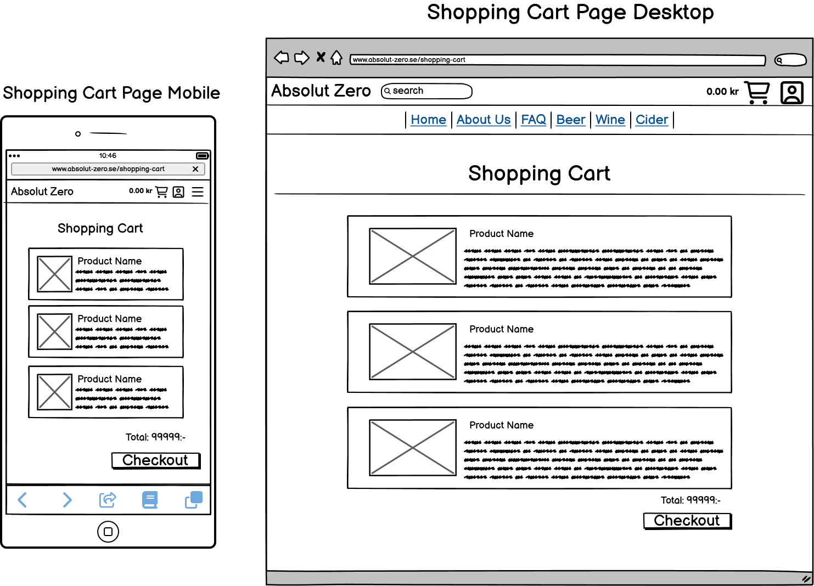
</details>
<details><summary>Login page</summary>
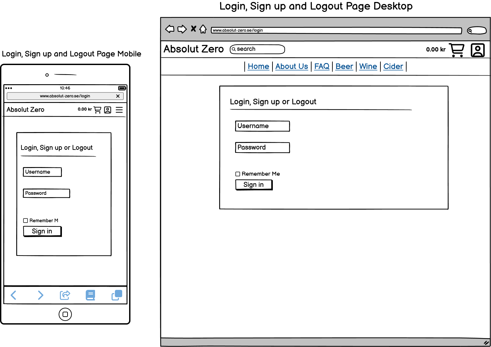
</details>
<details><summary>Error page</summary>
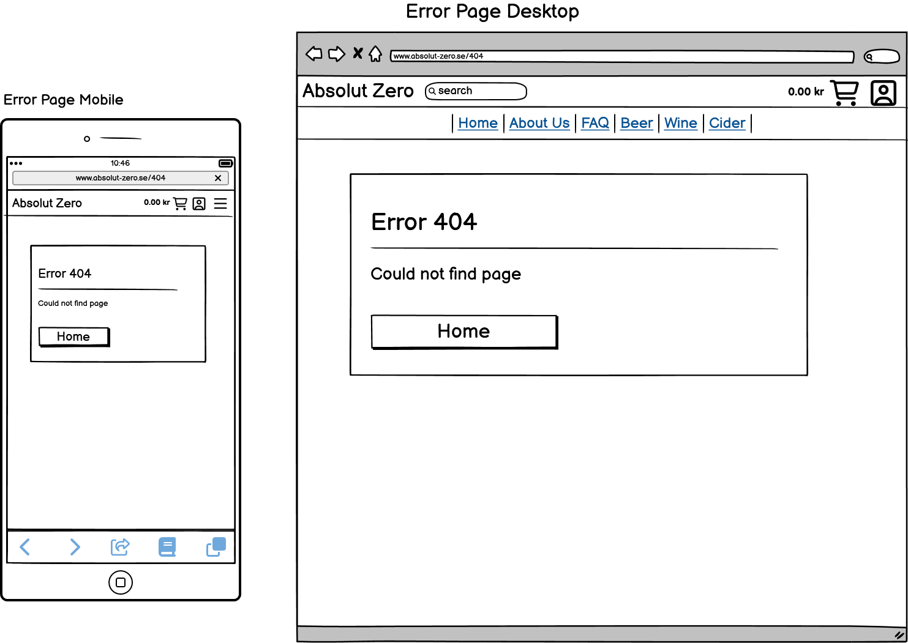
</details>
<br>
During development, the designs have evolved and changed due to testing and user feedback. As a result, the final implementation may vary from these initial wireframes.

[Back to top ⇧](#table-of-contents)

## Database and models

[ElephantSQL](https://customer.elephantsql.com/) was used as a database for the whole project.

Mapping out the database structure before coding is crucial for organizing information, reducing errors, and improving efficiency. That is why a Database schema was made before the start of development. 
[dbdiagram.io](https://dbdiagram.io/) was used to generate the database schema.

The Database schema has been slightly altered through development due to new ideas.

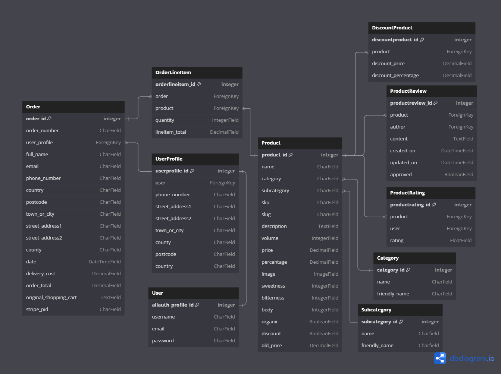

### Product Model

The ``Product`` model is the main model and is linked to the ``Category``, ``Subcategory``, ``DiscountProduct``, ``ProductRating``, ``ProductReview`` and ``OrderLineItem`` models. It's main purpose is to store information about a product.

### Category Model

The ``Category`` model is linked to the ``Product`` model and stores the different types of categories for the ``Product`` model.

### Subcategory Model

The ``Subcategory`` model is linked to the ``Product`` model and stores the different types of subcategories for the ``Product`` model.

### DiscountProduct Model

The ``DiscountProduct`` model is linked to the ``Product`` model and is used to set discounts linked to the ``Product`` model.

### ProductRating Model

The ``ProductRating`` model is linked to the ``Product`` model and is used to det ratings linked to the ``Product`` model.

### ProductReview Model

The ``DiscountProduct`` model is linked to the ``Product`` model and is used to write reviews linked to the ``Product`` model.

### User(Allauth) Model

The ``User`` model is an integral component of Django Allauth, featuring pre-established fields as part of its standard configuration. This model primarily serves the purpose of user authentication, which is why it is not recommended to make direct alterations to it. Furthermore, the ``User`` model is linked to the ``UserProfile`` model through a one-to-one relationship, facilitating the management of user-specific data and interactions.

### UserProfile Model

The ``UserProfile`` model is linked to the ``User`` model and stores the contact information of the user.

### Order Model

The ``Order`` model is linked to the ``UserProfile`` model and stores information about a users order. It grabs the product information through the ``OrderLineItem`` model to get the type of product, quantity and total price.

### OrderLineItem Model

The ``OrderLineItem`` model is linked to the ``Order`` model and assists it to complete and store the order.

[Back to top ⇧](#table-of-contents)

## Technologies Used

### Languages

- HTML
- CSS
- Python
- JS

### Frameworks

- **Django v4.2:** Django is a high-level Python web framework that encourages rapid development and clean, pragmatic design. Built by experienced developers, it takes care of much of the hassle of web development, so you can focus on writing your app without needing to reinvent the wheel. It’s free and open source.

- **Crispy Forms:** Django-crispy-forms is an application that helps to manage Django forms. It allows adjusting forms' properties (such as method, send button or CSS classes) on the backend without having to re-write them in the template.

- **Bootstrap v5.3:** Bootstrap is a free, open source front-end development framework for the creation of websites and web apps. Designed to enable responsive development of mobile-first websites, Bootstrap provides a collection of syntax for template designs.

### Cloud Service
- **AWS:** AWS is a leading cloud computing platform offered by Amazon. It provides a wide range of services for businesses to build and deploy scalable, reliable, and secure applications and infrastructure. With AWS, businesses can innovate and grow without the burden of managing physical hardware.

### Database

- **ElephantSQL:** ElephantSQL is a service that offers PostgreSQL database hosting. It removes the tedious work by automating the setup and running of Postgres clusters. It also automates the tasks such as upgrades and backups

### Tools

- **Git**: A distributed version control system used for tracking changes in the project's source code.

- **GitHub:** GitHub is a web-based platform for version control using Git. It facilitates collaborative software development, allowing multiple contributors to work on projects, track changes, and manage code repositories.

- **Heroku:** Heroku is a cloud platform that enables developers to deploy, manage, and scale applications easily. It supports various programming languages and eliminates the need for infrastructure management, making it simpler to focus on building and deploying applications.

- **Google Fonts:** Google Fonts is a free and extensive collection of web fonts provided by Google. It allows website developers to embed customizable fonts, enhancing the typography of web content.

- **Font Awesome:** Font Awesome is a popular icon toolkit that provides a wide range of scalable vector icons. It's commonly used in web development to enhance the visual appeal and functionality of websites by easily incorporating icons into the design.

- **DB diagram:** An online database design and diagramming tool that simplifies the process of creating and visualizing database schemas. dbdiagram.io was used for designing and documenting the database schema of the EasyKeyboardMaker project.

- **Balsamiq:** Balsamiq is an intuitive wireframe tool that simplifies the process of designing user interfaces for web and mobile applications. With its user-friendly interface and extensive library of pre-built components, Balsamiq enables developers and designers to quickly create mockups and prototypes, facilitating collaboration and iteration throughout the design process.

- **Mailchimp:** Mailchimp is an all-in-one marketing platform that empowers businesses to manage their email marketing campaigns, build customer relationships, and drive growth. With its intuitive interface and powerful features, Mailchimp simplifies the process of creating, sending, and tracking email campaigns, allowing businesses to engage with their audience effectively and efficiently.

### Supporting Libraries and Packages
- asgiref==3.7.2
- boto3==1.34.76
- botocore==1.34.76
- certifi==2024.2.2
- cffi==1.16.0
- charset-normalizer==3.3.2
- crispy-bootstrap5==2024.2
- cryptography==42.0.5
- defusedxml==0.7.1
- dj-database-url==2.1.0
- Django==4.2.11
- django-allauth==0.62.1
- django-countries==7.6.1
- django-crispy-forms==2.1
- django-storages==1.14.2
- gunicorn==21.2.0
- idna==3.6
- jmespath==1.0.1
- oauthlib==3.2.2
- packaging==24.0
- pillow==10.2.0
- psycopg2==2.9.9
- pycparser==2.21
- PyJWT==2.8.0
- python-dateutil==2.9.0.post0
- python3-openid==3.2.0
- requests==2.31.0
- requests-oauthlib==1.4.0
- s3transfer==0.10.1
- six==1.16.0
- sqlparse==0.4.4
- stripe==2.42.0
- typing_extensions==4.10.0
- tzdata==2024.1
- urllib3==1.26.18
- whitenoise==6.6.0

[Back to top ⇧](#table-of-contents)

## Agile Methodology

Agile methodology emphasizes iterative development and collaboration, enabling teams to respond to change quickly and deliver high-quality products efficiently. We chose Agile for this project to foster adaptability, enhance collaboration, and ensure continuous improvement throughout the development process.

### Kanban Board

All epics and user stories implementation progress was registered using [GitHub](https://github.com/). As the user stories were accomplished, they were moved in the GitHub Kanban board from **To Do**, to **In Progress**, **Done** and **Future features/Won't have** sections on the board.

Visit the project page to view the live [Kanban board](https://github.com/users/Tossan99/projects/7)

<details>
<summary>Kanban Board</summary>

</details>

### Epics

All user stories were divided into epics, representing larger user stories. In total, four epics were created to cover the entire project.

Visit the project page to view the live [epics](https://github.com/users/Tossan99/projects/7)

<details>
<summary>Epics</summary>
    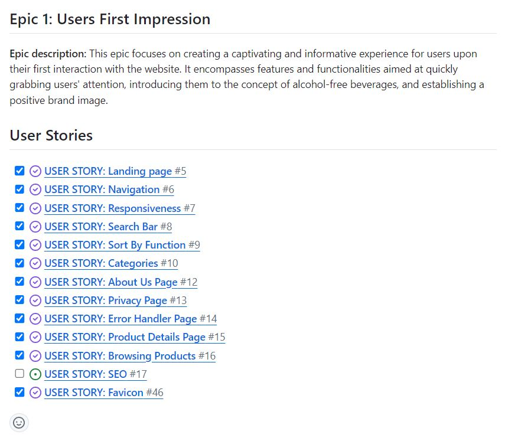
    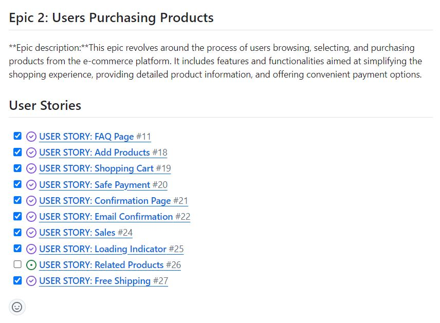
    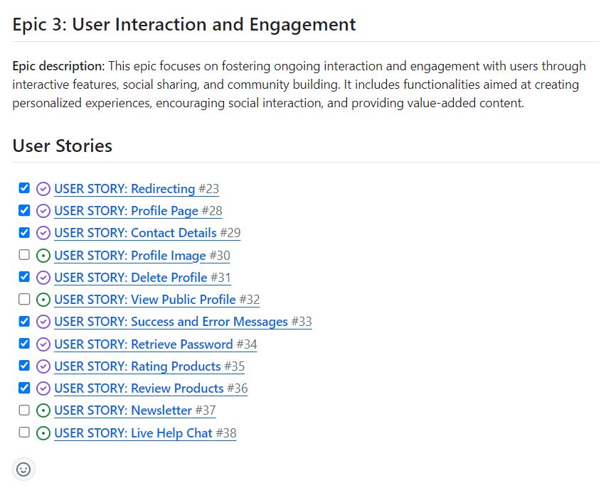
    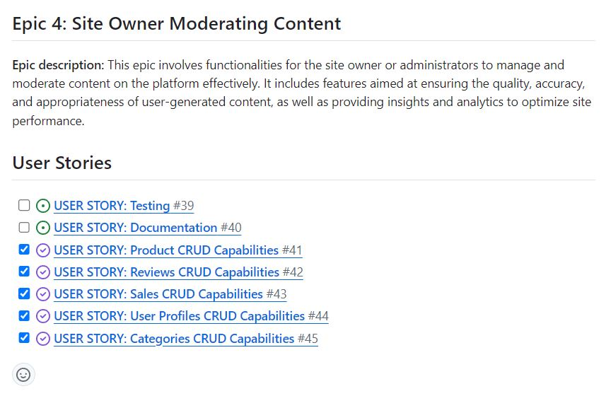
</details>

### Sprints

Each user story was categorized into sprints to establish the sequence of completion for each. In total, seven sprints were created to organize all user stories.<br>
All sprints were made with the Github milestones feature.

Visit the milestones page to view the live [sprints](https://github.com/Tossan99/absolut-zero/milestones)

<details>
<summary>Sprints</summary>
    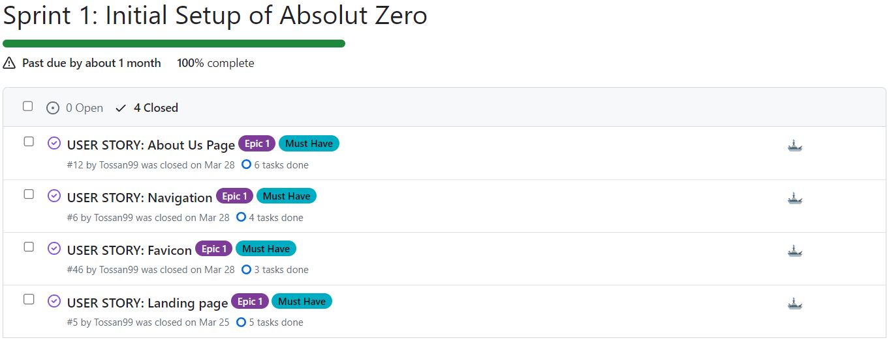
    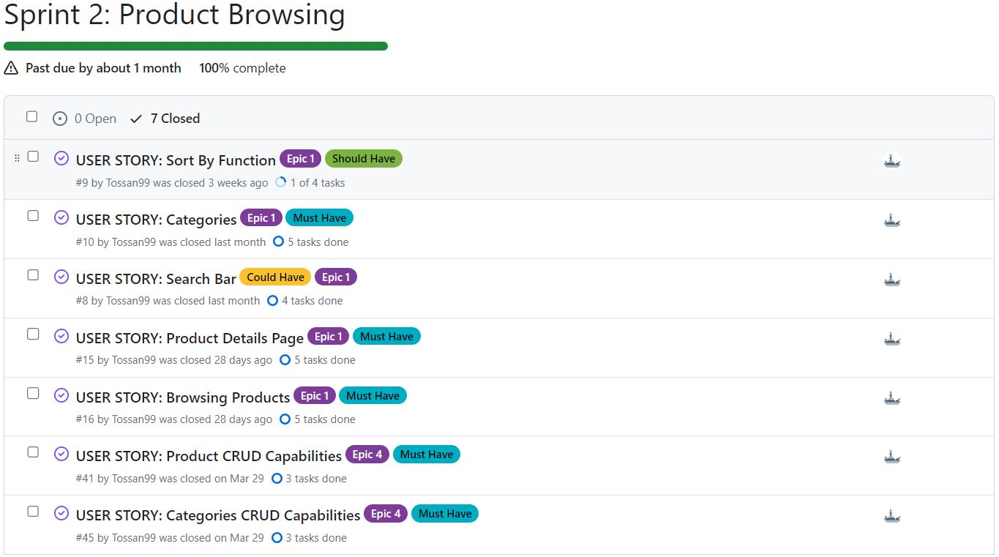
    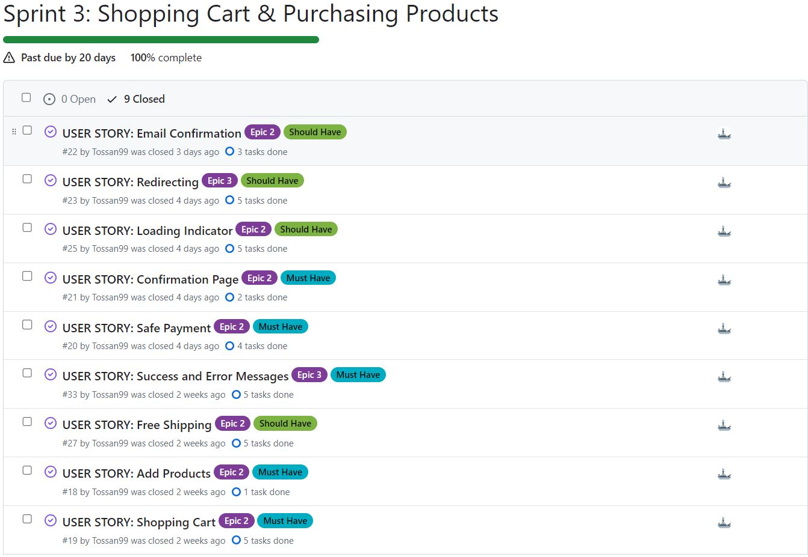
    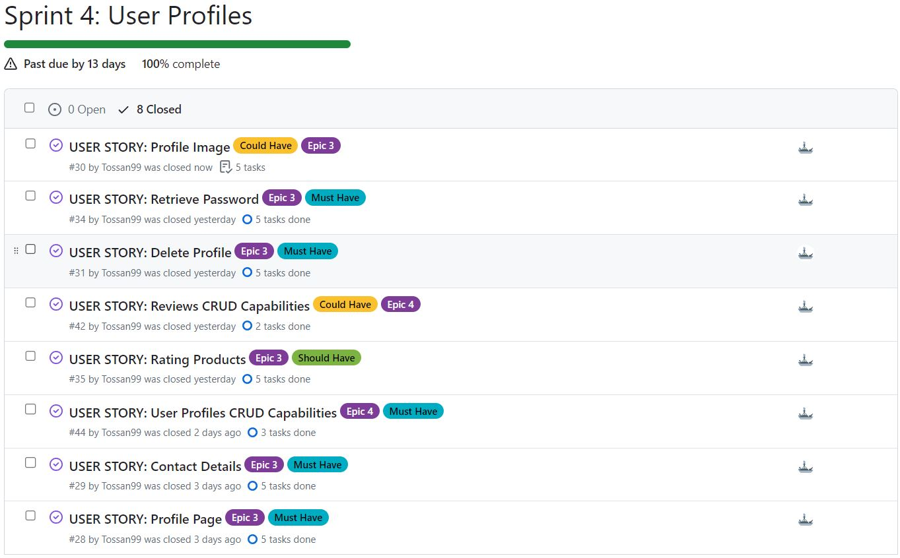
    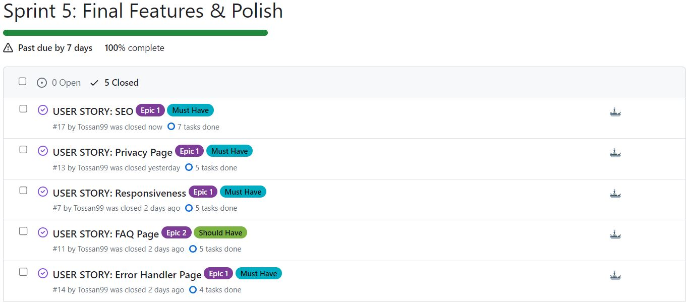
    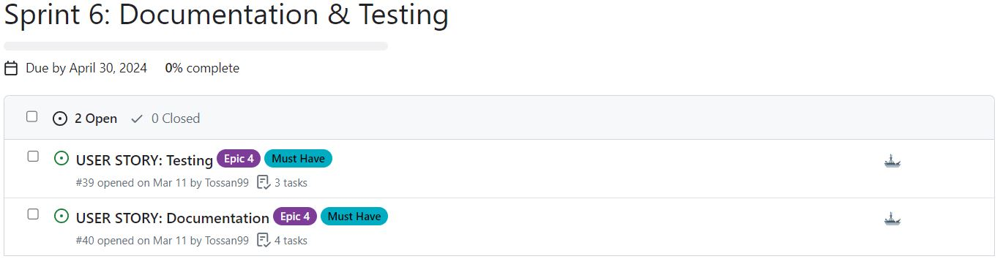
    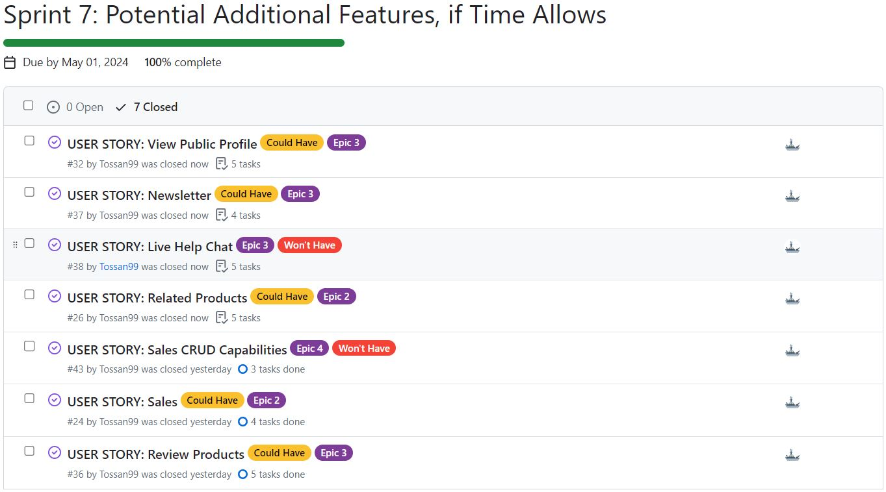
</details>

### User Stories as GitHub Issues

Turning user stories into GitHub issues helps organize user-focused features. These issues are linked to their corresponding user stories, making it easier to access criteria, tasks, and discussions.

### Bug Tracking for Seamless Development

We document bugs found during development as GitHub issues. This provides details on each bug's characteristics, impact, and how to reproduce it. By adding links to these issues in README.md, users can stay informed about bug fixes and share their thoughts.

### User Story Distribution (MoSCoW)

For this project, MoSCoW was used for the user stories to prioritizes implementation of features. MoSCoW is a project management framework that prioritizes requirements into four categories: `Must Have` (critical for success), `Should Have` (important), `Could Have` (desirable if resources permit), and `Won't Have` (explicitly excluded or deferred).

As seen in the chart below, the user stories prioritized as `Must Have` account for approximately 60%, while those prioritized as `Could Have` account for approximately 20%. The remaining 20% is shared between `Should Have` and `Won't Have`.


<small>The percentages aren't displayed in the pie chart since it's considered poor data representation to use percentage points for any data with fewer than 100 data points.</small>

[Back to top ⇧](#table-of-contents)

## Features

### Home/Landing Page

-  <details><summary>See **Landing/About Page**</summary></details>

### About Page

-  <details><summary>See **Landing/About Page**</summary></details>

### Products Page

-  <details><summary>See **Landing/About Page**</summary></details>

### Product Details Page

-  <details><summary>See **Landing/About Page**</summary></details>

### Profile Page

-  <details><summary>See **Landing/About Page**</summary></details>

### Account Pages

-  <details><summary>See **Landing/About Page**</summary></details>

### Error pages

-  <details><summary>See **Landing/About Page**</summary></details>

### Future Features

These are some features that weren't added due to lack of time.

- **Placeholder:**

[Back to top ⇧](#table-of-contents)

## Testing

the Absolut Zero E-commerce website went through a comprehensive testing process to guarantee its functionality, accessibility, and performance. This included checking the code, such as code validation, accessibility assessment, performance testing, cross-device testing, verification of browser compatibility, assessment of user stories, and the integration of user feedback to enhance the overall user experience.

All testing was conducted and documented in [Testing.md](TESTING.md) for easy accessibility.

[Back to top ⇧](#table-of-contents)

## Deployment and Local Development

Live deployment can be found here [Absolute Zero](https://absolut-zero-9622981fe97d.herokuapp.com/)

### App Deployment
For deploying Your app, Heroku is used. Follow these steps:

 **Create a New App:**
   - Create a new app on Heroku dashboard.

 **Configure Settings:**
   - Navigate to "Settings" in new app.

 **Config Vars Setup:**
   - In "Config Vars," add `PORT` as the key and `8000` as its value.

 **Add PostgreSQL Database:**
   - Choose PostgreSQL as database.

        Example "ElephantSQL" was used in this project

 **Configure DATABASE_URL:**
   - In "Config Vars," add `DATABASE_URL` and copy the URL from PostgreSQL dashboard.

     Note: If using ElephantSQL as PostgreSQL provider, you can use the URL provided by ElephantSQL.

 **Environment Variable Setup:**
   - Create a new file in workspace called `env.py`.
   - Import the `os` library and set the environment variable for `DATABASE_URL` to the Heroku address (or ElephantSQL URL)
   - Add a secret key using `os.environ["SECRET_KEY"] = "your secret key here"`.

 **Heroku Config Vars:**
   - Add the secret key to the Heroku app's config vars in the settings.

 **Django Settings:**
   - In `settings.py` of Django app, import `Path` from `pathlib`, `os`, and `dj_database_url`.
   - Add `if os.path.isfile("env.py"): import env` to the file.
   - Replace the SECRET_KEY with `SECRET_KEY = os.environ.get('SECRET_KEY')`.
   - Replace the database section with `DATABASES = {'default': dj_database_url.parse(os.environ.get("DATABASE_URL"))}`.

 **Migrate Models:**
   - In workspace terminal, migrate the models to the new database connection.

### Custom Domain configuration

1. **Register Domain:**
   - Register a domain with a domain registrar (e.g., GoDaddy).

2. **Add Custom Domain in Heroku:**
   - Go to the "Settings" tab of your Heroku app.
   - Scroll down to "Domains" and click "Add Domain."
   - Enter your custom domain (e.g., `www.absolutzero.com`).
   - Copy the provided DNS target. It will look something like `shallow-atoll-32t56jvds3s5fhf8767d9a9c.herokudns.com`.

3. **Configure DNS Records:**
   - Log in to your domain registrar.
   - Navigate to DNS settings.
   - Add a CNAME record:
      - Type: CNAME
      - Name: www
      - Value: Paste Heroku's DNS target
      - TTL: Set to default

4. **Verify Domain Configuration:**
   - Check the "Domains" section in your Heroku dashboard.
   - Wait for DNS changes to propagate (up to 48 hours).

5. **HTTP and HTTPS Forwarding (Optional):**
   - Optionally, configure forwarding in your domain registrar's settings.

6. **Verify Custom Domain:**
   - After DNS propagation, access your app using the custom domain.

6. **Add ACCESS_HOSTNAME to your project settings:**
   - Add "www.yourdomain.com" to `ALLOWED_HOSTS` in your Django app's settings.py file.

### Version Control
To manage version control and push code to the main repository on GitHub using GitPod, follow these steps:

 **Add Changes:**
   - In the GitPod terminal, use the command `git add .` to stage changes.

 **Commit Changes:**
   - Commit changes with a descriptive comment using the command:
     ```
     git commit -m "Push comment here"
     ```

 **Push to GitHub:**
   - Push the updates to the repository on GitHub with the command:
     ```
     git push
     ```


 **Migrate Models:**
    - In the terminal, migrate the models to the new database connection.

### Forking the Repository

By forking the GitHub Repository, can create a copy of the original repository without affecting the original. Follow these steps:

 **GitHub Account Setup:**
   - Log into GitHub account or create one if you don't have one.

 **Locate the Repository:**
   - Find the repository at [https://github.com/Tossan99/absolut-zero](https://github.com/Tossan99/absolut-zero).

 **Fork the Repository:**
   - At the top right of the repository page, click "Fork" to create a copy in your own GitHub repository.

### Clone of the Repository:

Creating a clone allows you to have a local copy of the project. Follow these steps:

 **Repository URL:**
   - Navigate to [https://github.com/Tossan99/absolut-zero](https://github.com/Tossan99/absolut-zero).
   - Click the green "Code" button at the top right.

 **Clone the Repository:**
   - Select the "Clone by HTTPS" option and copy the provided URL to the clipboard.

 **Terminal and Git:**
   - Open your code editor or terminal and navigate to the directory where you want to clone the repository.
   - Run `git clone` followed by the copied URL.
   - Press enter, and Git will clone the repository to your local machine.


To fork the repository, follow these steps:

1. Go to the GitHub repository.
2. Click on the Fork button in the upper right-hand corner.
3. Wait for the forking process to complete. Once done, you will have a copy of the repository in your GitHub account.

To clone the repository, follow these steps:

1. Go to the GitHub repository.
2. Locate the Code button above the list of files and click it.
3. Select your preferred method for cloning: HTTPS, SSH, or GitHub CLI, and click the copy button to copy the repository URL to your clipboard.
4. Open Git Bash (or your preferred terminal).
5. Change the current working directory to the location where you want the cloned directory to be created.
6. Type the command `git clone` followed by the URL you copied in step 3. The command should look like this: `git clone https://github.com/YOUR-USERNAME/YOUR-REPOSITORY`.
7. Press Enter to create your local clone.

[Back to top ⇧](#table-of-contents)

## Credits

### Media
Images are taken from the following page:
- []() **Used as a landing page hero image**
- []() **Used for some of the product images, this images are not made by me or easy keyboard maker**


### Django Documentation
The official Django documentation has been an invaluable resource throughout the project, providing comprehensive guidance on models, forms, templates, and various aspects of Django development.

- [Models](https://docs.djangoproject.com/en/4.2/topics/db/models/)
- [Form Validation](https://docs.djangoproject.com/en/4.1/ref/forms/validation/)
- [Model Field Types](https://docs.djangoproject.com/en/4.2/ref/models/fields/#model-field-types)
- [CSRF Trusted Origins](https://docs.djangoproject.com/en/4.0/ref/settings/#csrf-trusted-origins)
- [Built-in template tags and filters](https://docs.djangoproject.com/en/4.2/ref/templates/builtins/)
- [Creating forms from models](https://docs.djangoproject.com/en/4.2/topics/forms/modelforms/)
- [Model instance reference](https://docs.djangoproject.com/en/4.2/ref/models/instances/)
- [Signals](https://docs.djangoproject.com/en/4.2/topics/signals/)
- [Using mixins with class-based views](https://docs.djangoproject.com/en/4.2/topics/class-based-views/mixins/#detailview-working-with-a-single-django-object)
- [Using widgets in the form](https://docs.djangoproject.com/en/4.2/ref/forms/widgets/)
- [Date string form](https://docs.djangoproject.com/en/3.2/ref/templates/builtins/#date)
- [Custom Clearables](https://github.com/django/django/blob/main/django/forms/templates/django/forms/widgets/clearable_file_input.html)
- [Annotate() used to add aggregate values to each objects in a queryset](https://docs.djangoproject.com/en/3.2/ref/models/querysets/#annotate)
- [Avg calculates the average value of my review star rating](https://docs.djangoproject.com/en/3.2/topics/db/aggregation/#avg)
- ['help_text' used to perform sub text under input field in forms](https://docs.djangoproject.com/en/3.2/ref/forms/fields/#help-text)
- [DoesnotExist, used to check is product is existing](https://docs.djangoproject.com/en/3.2/ref/models/class/#django.db.models.Model.DoesNotExist)

### W3 Schools
- [Overrite Bootstraps css variables](https://www.w3schools.com/css/css_important.asp)

### Bootstrap docs
- [Increase knowledge of bootstrap framework](https://getbootstrap.com/docs/5.3/getting-started/introduction/)

### Content
- Paragraphs/text for the webpage/readme was written together with [ChatGPT](https://chat.openai.com/) and [Phind](https://www.phind.com/search?home=true)

[Back to top ⇧](#table-of-contents)

## Acknowledgments
- Code Institute Slack Channel: #community-sweden I received feedback from numerous users in a channel where I shared my E-commerce project. I am genuinely appreciative of the valuable feedback I received from the community.

[Back to top ⇧](#table-of-contents)